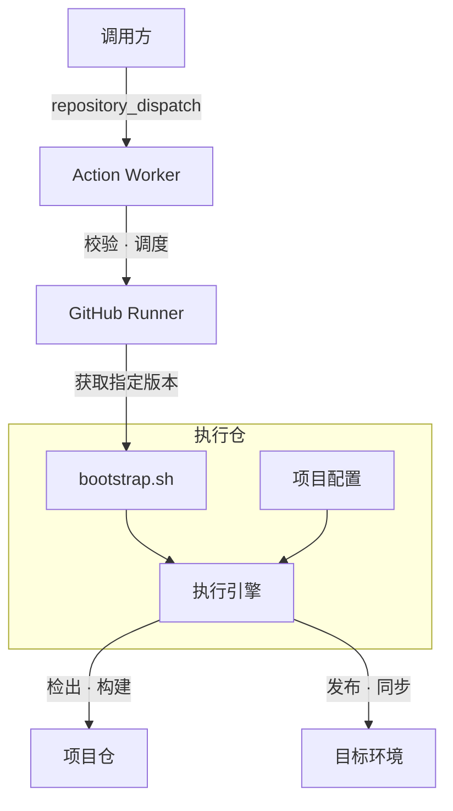

<div align="center">

# Action Worker

[](https://github.com/fongap/action-worker/actions/workflows/task-handler.yml)
[](LICENSE)

让 GitHub Actions 专注调度，把构建、发布与同步交给真正的执行层。

</div>

## 这是什么

**Action Worker** 是一个解耦「调度」与「执行」的 CI/CD 执行节点。它本身不承载任何具体的构建逻辑，只负责接收任务请求、校验参数、拉取指定版本的执行脚本，再把真正的检出、构建、发布与环境同步工作交给下游的**执行仓**完成。

这样设计带来的好处：

- **面向私有资产仓**：专为需要拉取私有仓库内容并执行密集型构建/部署任务的场景设计。
- **调度与执行解耦**：Action Worker 保持轻量，执行逻辑可以独立迭代、独立版本化，互不影响。
- **可复用的执行层**：任意调用方（其他仓库、内部平台、定时任务）都可以通过标准的 `repository_dispatch` 触发同一套执行流程。

## 工作原理



1. **调用方**通过 `repository_dispatch` 事件（`run-task` 类型）携带任务参数触发 Action Worker。
2. **Validate 阶段**校验请求参数的格式与合法性，并解析出本次任务的关键信息。
3. **Execute 阶段**根据参数从指定的执行仓拉取对应版本（commit SHA）的 `bootstrap.sh`，做语法检查后再执行。
4. `bootstrap.sh` 负责调用执行仓内的执行引擎，完成目标项目仓的检出、构建，并发布/同步到目标环境。

## 请求协议

调用方需要向本仓库发送 `repository_dispatch` 事件，`event_type` 固定为 `run-task`，`client_payload` 需包含以下字段：

| 字段 | 类型 | 说明 |
| --- | --- | --- |
| `schema_version` | string | 协议版本号，当前仅支持 `"1"` |
| `request_id` | string | 任务请求 ID，仅允许字母、数字、`.`、`_`、`-`，最长 128 字符 |
| `project` | string | 目标项目标识，需以字母或数字开头，最长 64 字符 |
| `bootstrap_ref` | string | 执行脚本所在的完整 40 位 Commit SHA（不接受分支名，避免非固定版本被篡改） |

所有字段均为必填字符串，且不允许出现协议之外的未知字段，请求会在 Validate 阶段被严格校验并拒绝不合规的调用。

### 触发示例

```bash
curl -X POST \
  -H "Authorization: Bearer <TOKEN>" \
  -H "Accept: application/vnd.github+json" \
  https://api.github.com/repos/fongap/action-worker/dispatches \
  -d '{
    "event_type": "run-task",
    "client_payload": {
      "schema_version": "1",
      "request_id": "20260910-001",
      "project": "my-project",
      "bootstrap_ref": "<40 位 commit SHA>"
    }
  }'
```

## 配置要求

Execute 阶段依赖以下仓库级配置：

| 名称 | 类型 | 说明 |
| --- | --- | --- |
| `GH_EXECUTION_REPO` | Variable | 执行仓地址，格式为 `owner/repo` |
| `GH_EXECUTION_REPO_PAT` | Secret | 拉取执行仓 `bootstrap.sh` 所需的访问凭据 |

任务执行所需的其余密钥（部署凭据、发布 Token 等）通过 workflow 的 `secrets` 上下文注入到 `bootstrap.sh` 的执行环境中，由执行引擎按需读取。

## 安全设计

- `bootstrap_ref` 强制要求完整 40 位 Commit SHA，杜绝使用可变分支名，防止执行脚本在运行期间被替换。
- 拉取到的 `bootstrap.sh` 会先做 `bash -n` 语法检查，再赋予执行权限并运行，降低脚本损坏或截断带来的风险。
- 同一 `project` 的任务通过 `concurrency` 分组串行执行，避免并发任务互相干扰同一目标环境。
- 执行前会快照基础环境变量，便于在任务结束后清理敏感信息，减少凭据残留。

## 目录结构

```
.
├── .github/workflows/   # Task Handler 工作流定义
├── scripts/             # 校验、辅助脚本（如 payload 校验）
├── tests/               # 测试用例
└── LICENSE
```

## 开源协议

本项目基于 [MIT License](LICENSE) 开源。
