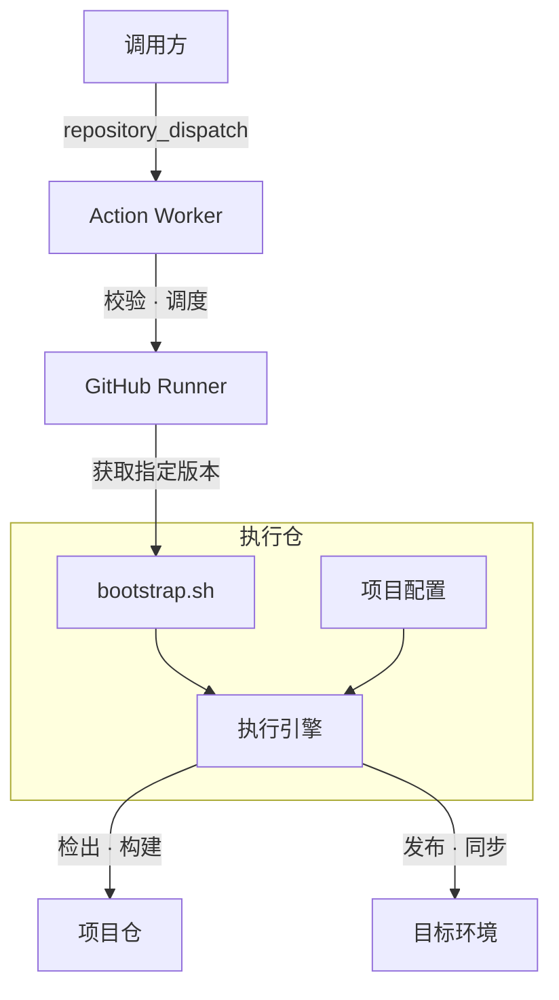

    
# Action Worker

让 GitHub Actions 专注调度，把构建、发布与同步交给真正的执行层。

```mermaid
flowchart TB
    A[调用方]
    B[Action Worker]
    C[GitHub Runner]

    subgraph R["执行仓"]
        D[bootstrap.sh]
        E[执行引擎]
        F[项目配置]
    end

    G[项目仓]
    H[目标环境]

    A -->|repository_dispatch| B
    B -->|校验 · 调度| C
    C -->|获取指定版本| D

    D --> E
    F --> E

    E -->|检出 · 构建| G
    E -->|发布 · 同步| H
```

