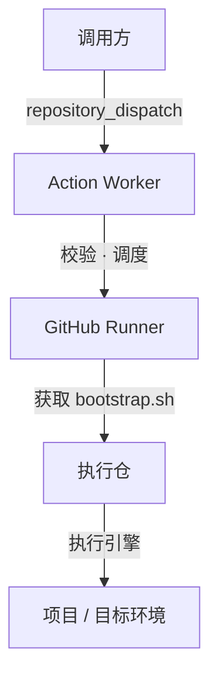
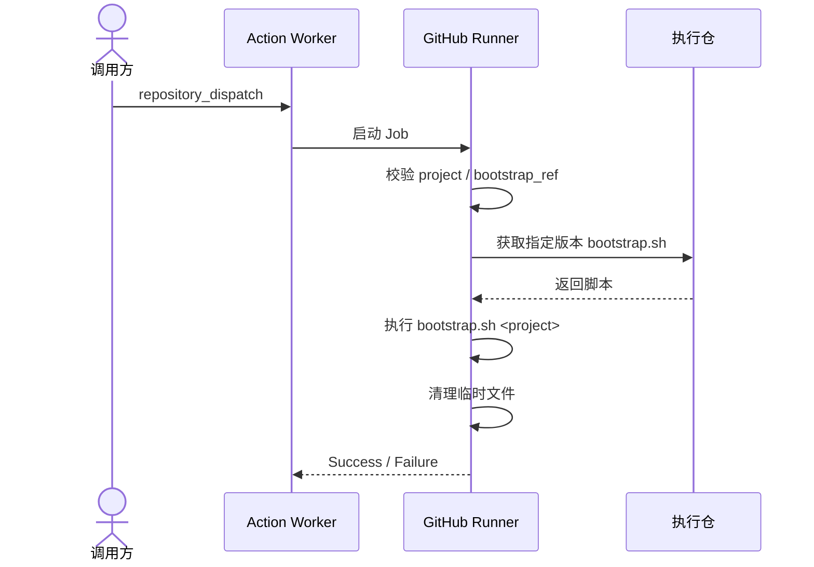

# Action Worker

> **公开入口，受控执行**
> 基于 GitHub Actions 的轻量任务调度层。

Action Worker 负责**接收任务、校验输入、控制并发与启动执行**；构建、发布、同步等业务逻辑全部下沉至执行仓。

## 架构

```mermaid
flowchart TB
    A[调用方]
    B[Action Worker]
    C[GitHub Runner]
    D[执行仓]
    E[项目 / 目标环境]

    A -->|repository_dispatch| B
    B -->|校验 · 调度| C
    C -->|获取 bootstrap.sh| D
    D -->|执行引擎| E
```

## 执行

```mermaid
sequenceDiagram
    actor Caller as 调用方
    participant AW as Action Worker
    participant Runner as GitHub Runner
    participant Repo as 执行仓

    Caller->>AW: repository_dispatch
    AW->>Runner: 启动 Job
    Runner->>Runner: 校验 project / bootstrap_ref
    Runner->>Repo: 获取指定版本 bootstrap.sh
    Repo-->>Runner: 返回脚本
    Runner->>Runner: 执行 bootstrap.sh <project>
    Runner->>Runner: 清理临时文件
    Runner-->>AW: Success / Failure
```
