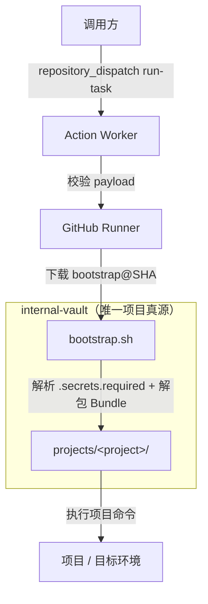

<div align="center">

# Action Worker

[](https://github.com/fongap/action-worker/actions/workflows/task-handler.yml)
[](https://github.com/fongap/action-worker/actions/workflows/ci.yml)
[](LICENSE)

> 基于 GitHub Actions 的极薄任务执行入口。**只做输入校验 → 拉固定 SHA 的 bootstrap → 执行 → 返回状态。** 不持有任何项目业务逻辑。


</div>

## 角色定位

| 仓库 | 角色 |
|------|------|
| `action-worker`（本仓） | 公共/私有执行入口。输入校验 + 拉 bootstrap + 启动 + 状态返回 |
| `internal-vault` | 唯一项目真源。`projects/<project>/` 描述每个项目的 bootstrap、`.secrets.required`、构建流程 |
| `bootstrap.sh`（在 internal-vault 仓中） | 拉取 internal-vault、解析 `.secrets.required`、在 exec 项目命令前 `unset` Vault 凭据 |

新增项目时：

* 在 `internal-vault` 中新增 `projects/<project>/` 目录并提交（按 SHA 引用）；
* 为该项目创建同名 GitHub Environment，并在该 Environment 内配置一个 Secret `PROJECT_SECRETS_JSON`（JSON 字符串，包含该项目的全部 Secret 键值对）；
* **不要修改本仓任何代码**。

## 触发方式

事件固定为 `run-task`。`client_payload` 严格白名单：

```json
{
  "event_type": "run-task",
  "client_payload": {
    "schema_version": "1",
    "request_id": "req-2026-09-08-001",
    "project": "FongapBlog",
    "bootstrap_ref": "40位Git提交SHA"
  }
}
```

| 字段 | 必填 | 校验规则 |
|------|------|----------|
| `schema_version` | 是 | 当前支持 `"1"`，其它值一律拒绝 |
| `request_id` | 是 | `^[A-Za-z0-9_.-]{1,128}$` |
| `project` | 是 | `^[A-Za-z0-9_.-]+$`（仅字符集校验） |
| `bootstrap_ref` | 是 | 完整 40 位十六进制 Commit SHA |

任何未知字段均会被拒绝。任何带 `command` / `script` / `secret` / 任意脚本内容的 payload 都会被拒绝。

`repository_dispatch` 的授权边界由调用方持有的专用 dispatch 凭据（推荐命名为 `GH_ACTION_WORKER_PAT`）承担——该凭据仅允许调用本仓的 `repository_dispatch`，作用是审计与限速，不是授权判断。Worker 不读取、不验证它。

## 所需配置

### Repository Variable（本仓）

| Variable | 用途 |
|----------|------|
| `GH_EXECUTION_REPO` | 执行仓地址（如 `owner/internal-vault`） |

### Repository Secret（本仓）

| Secret | 用途 |
|--------|------|
| `GH_EXECUTION_REPO_PAT` | 下载 bootstrap.sh + bootstrap 拉取 internal-vault 的凭据。bootstrap 完成 vault 克隆后必须立即 `unset`；Worker 在 bootstrap 退出后再做一次防御性 unset |

### Project Environment（每个项目一个）

项目新增时创建同名 Environment（如 `FongapBlog`）。该 Environment 内仅保存一个 Secret：

| Environment Secret | 用途 |
|--------------------|------|
| `PROJECT_SECRETS_JSON` | 该项目的全部 Secret，以 JSON 字符串形式保存。`internal-vault` 的 `.secrets.required` 决定其中哪些键被实际使用 |

Worker 不解析 `PROJECT_SECRETS_JSON` 的键集合，不为每个键建立单独 env 映射——这就是“统一项目 Secret Bundle”模型。`internal-vault` 自行按需解包。

> 不要把所有项目的 Secret 汇总为一个全局 Bundle。每个项目必须有独立 Environment，名称与 `client_payload.project` 严格对应。

> **不再使用 `PROJECT_ALLOWLIST` Variable。** 项目授权唯一真源是 `internal-vault` 的 `projects/<project>/` 目录。Worker 不持有第二份项目清单。

## 安全边界

* **最小权限**：`permissions: {}`。不向 GITHUB_TOKEN 申请任何 scope。
* **凭据生命周期**：`GH_EXECUTION_REPO_PAT` 仅在 Worker 下载 bootstrap 与 bootstrap 拉取 internal-vault 阶段存在；bootstrap 退出后 Worker 立即 `unset` 并验证 env 中不存在。
* **无 GITHUB_TOKEN fallback**：Worker 不读取 `GITHUB_TOKEN`、不向 bootstrap 注入。
* **项目授权**由 `internal-vault` 负责（`projects/<project>/` 存在即授权）。Worker 不保存第二份项目清单。
* **dispatch 凭据**与 **vault 凭据** 完全分离：调用方持有 `GH_ACTION_WORKER_PAT` 调入口，Worker 用 `GH_EXECUTION_REPO_PAT` 拉 vault。两者互不替代。
* **payload 严格白名单**：`schema_version` / `request_id` / `project` / `bootstrap_ref`，未知字段拒绝。
* **bootstrap 固定 SHA**：`bootstrap_ref` 必须为完整 40 位 Commit SHA；不接受 tag / branch。
* **curl 严格失败**：`--connect-timeout 15s` / `--max-time 60s` / 最多 3 次 / 仅对网络类/5xx 重试 / 4xx 立即终止。
* **日志脱敏**：仅打印 `request_id` / `schema_version` / `project` / `bootstrap_ref` / `Run ID` / 起止时间，不打印 Secret / Authorization header / 完整 payload / env dump。

## 执行流程

1. 接收 `repository_dispatch: run-task` 事件
2. 校验 `client_payload` 字段（schema_version、request_id、project、bootstrap_ref）
3. 校验 `GH_EXECUTION_REPO` / `GH_EXECUTION_REPO_PAT` / `PROJECT_SECRETS_JSON` 存在且 Bundle 是合法 JSON
4. 下载 `bootstrap.sh@${bootstrap_ref}`（严格失败 + 有限重试）
5. 执行 `bash bootstrap.sh "${project}" "${bootstrap_ref}" "${request_id}"`
6. Worker `unset GH_EXECUTION_REPO_PAT` 并验证 env 中不存在
7. 输出结果摘要

## 公共可见性风险

如果本仓保持 public，仓库外的任何人可以看到：

* `project` 名；
* `bootstrap_ref`（即执行仓中 `bootstrap.sh` 的具体 Commit SHA）；
* `request_id`；
* `Run ID` / 起止时间。

若你认为 `project` 名或执行仓的 SHA 也是内部信息，请把本仓改为 private，而不是依赖“日志尽量隐藏”。本 Worker 的日志脱敏只覆盖 Secret，不抹除以上业务上下文。

## 目录结构

```
action-worker/
├── .github/
│   └── workflows/
│       ├── ci.yml            # 本仓自身 CI（actionlint/shellcheck/yaml/payload tests）
│       └── task-handler.yml  # 唯一的生产 workflow
├── scripts/
│   └── validate-payload.sh   # payload 校验（被 CI 与本地测试调用）
├── tests/
│   ├── test-payload-validation.sh  # 验收测试：合法/非法 project/SHA/schema/未知字段
│   └── test-validator-sync.sh      # 同步校验：workflow 内联 validator == 脚本
├── .gitignore
├── LICENSE
└── README.md
```

本仓 **不会** 出现 `projects/` / `bricks/` / `preflight/` / `engine/` / 任何项目配置 / 任何项目业务代码。如发现以上内容即为污染。

## 本地验收（CI 自动覆盖）

| Case | 期望 |
|------|------|
| 合法 payload | exit 0 |
| `project` 含 `/` / `..` / 空格 / `\$` / 空 | exit 64 |
| `bootstrap_ref` 为 `main` / 短 SHA / 39 位 / 41 位 / 非 hex / 缺失 | exit 64 |
| `schema_version` 为 `0` / `2` / 空 / 缺失 | exit 65 (不支持版本) / 64 (缺失) |
| payload 含 `command` / `script` / `secret` 等未知字段 | exit 64 |
| `request_id` 超长 / 含非法字符 | exit 64 |
| `PROJECT_SECRETS_JSON` 不是合法 JSON | exit 1 |
| 任一必要 Variable/Secret 缺失 | exit 1 |

CI 不真实访问 `internal-vault`、不真实使用任何 Secret。

## 许可证

MIT License
